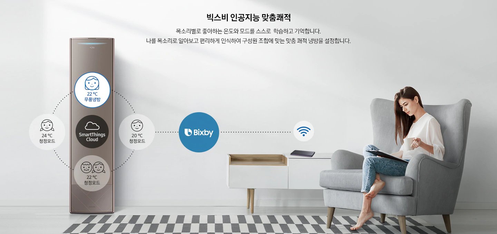
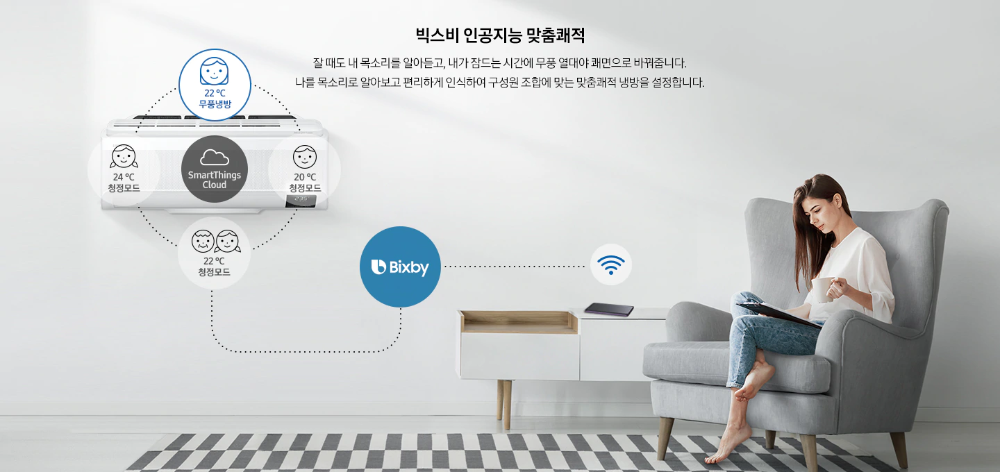

<!-- 로봇처소기 소개 문서 시작 -->

    

        
        

        

            

                

                    Robot Vacuum UX design
                    

                

                    수행업무: Control Panel UI design, remotre Control design
                

            

            
      

    

https://www.samsung.com/sec/business/system-air-conditioner-solutions/dms2-5/

    런던, 파리 현지 리서치 

19년도 Time 에어컨 신규 컨셉 및 공기청정기, 로봇청소기 파생디자인 참여
시기 : 2018년 상반기
성과 : Time 모델의 프로토타이핑 제작을 통한 신규컨셉 검증과 공기청정기, 로봇청소기의 기존 모델에서 엔트리 급에 대응할 수 있는 파생 디자인을 진행함.
참고 링크 : https://www.samsung.com/us/home-appliances/vacuums/powerbot-robot/powerbot--r7040-robot-vacuum-vr1am7040wg-aa/

구주 EHS 냉난방 시스템 컨트롤러 원형디자인 진행
시기 : 2018년 하반기
성과 : 구주 지역에 설치되는 EHS는 냉방과 난방, 온수를 종합적으로 제어하는 컨트롤러
효과 : 에어컨, 난방, 온수, 태양열 연동 등 홈 에너지 제어를 한번에 다양한 기능을 제어할 수 있도록 하며 여러 방에서 동시에 조작될 수 있도록 디자인하였음. 기존 LED 제품 경우에는설명서를 보지 않으면 사용하기 어려운 부분이 많았으나 신규 원형 과제 결과 누구나 사용할 수 있도록 디자인하여 구주 사용자들에게 해당 컨셉을 UT를 진행하여 사용성이 타사대비 우수하다는 의견을 받았음.

참고 링크 : https://www.youtube.com/watch?v=Trdtt0tmkJI
https://www.samsung.com/uk/business/air-to-water-heating-air-conditioners-ehs/

## Air Conditioner

더 똑똑해진 빅스비 음성인식
혼자 있어도, 함께 있어도 공간에 있는 사람을 목소리로 파악하는 빅스비 Voice ID가 사용자별 최적의 쾌적함을 찾아줍니다.
음성 명령만으로 컨텐츠 재생과 다른 가전 기기도 원격 제어할 수 있어 편리합니다.

잘 때도 똑똑하고 편리하게 인공지능 빅스비 음성인식
잘 때도 내 목소리를 알아듣고, 혼자 있어도, 함께 있어도 공간에 있는 사람을 목소리로 파악하는 빅스비 Voice ID가
사용자별 최적의 쾌적함을 찾아줍니다. 음성 명령만으로 컨텐츠 재생과 다른 가전 기기도 원격 제어할 수 있어 편리합니다.

<!-- EHS 소개 문서 시작 -->

    

        
        

        

            

                

                    EHS UX design
                

                

                    수행업무: Control Panel UI design, remotre Control design 
                

            

         

EHS – 유선리모컨 디자인 상품화 UX 
EHS의 신규 유선 리모컨으로 Non-Touch Color LCD 적용한 상품화 디자인 
다양한 7종 모델의 사양에 대응할 수 있는 디자인 
같이 설치될 수 있는 시스템 에어컨(VRF)을 고려한 일관성 있는 디자인과 사용성 
Non-Touch Color LCD를 적용한 EHS 유선리모컨 UX 디자인 
19.1Q 출시 예정인 VRF 유선리모컨과의 일관성 유지를 위한 디자인 개선 
Simple한 ON/OFF제어를 위해 시스템 에어컨과 동일하게 Home 화면 신규 추가. 
Home 화면 추가로 설치된 기기 ON/OFF 상태 확인과 Main Screen이 단순한 구성으로 개선됨.>
Operation Status의 화면 구성을 이해하기 쉽도록 Text 추가 
신규 추가된 17개 기능에 대한 Key screen 및 동작 flow 개발 
: Water Law, Water Outlet 설정 추가 
: EHS/ DHW/ 에어컨 유무에 따른 7가지 홈화면 디자인 
: FSV(field Setting Value) 메뉴 내 기능 92개 상세 설정을 고려한 화면 설계  
VRF 유선리모컨에 맞춘 UI, GUI 개선(9/3~10/30) 
: 프리미엄 유선 리모컨 개선한 look에 맞추어 EHS 전체 키스크린 제작 (약 200개) 
: GUI 가이드 분량 (약 400 page)  
• 개선된 GUI 화면에 맞추어 신규 VI 요소 발굴 (10/15~) 
: VI 가이드 분량 (약 40 page) 

https://www.samsunghvac.com/controls/individual-wired-controls

    

